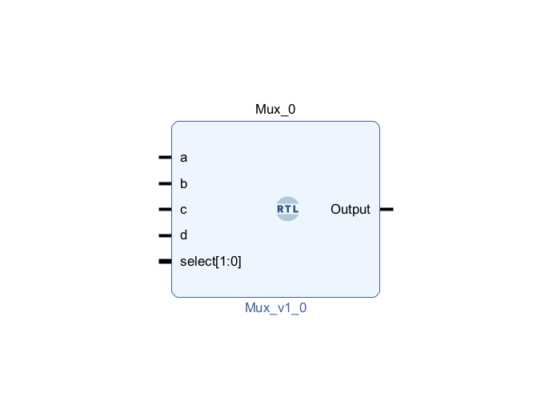
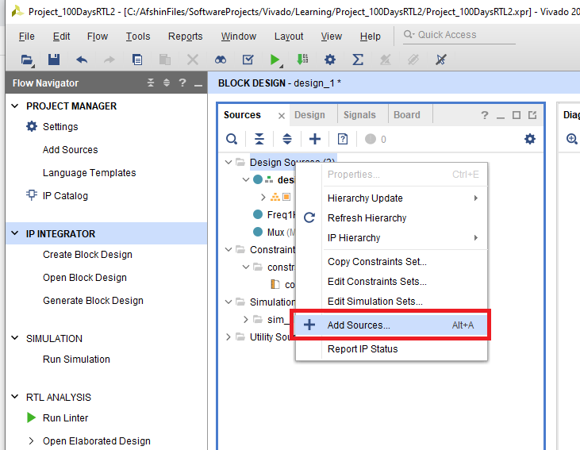
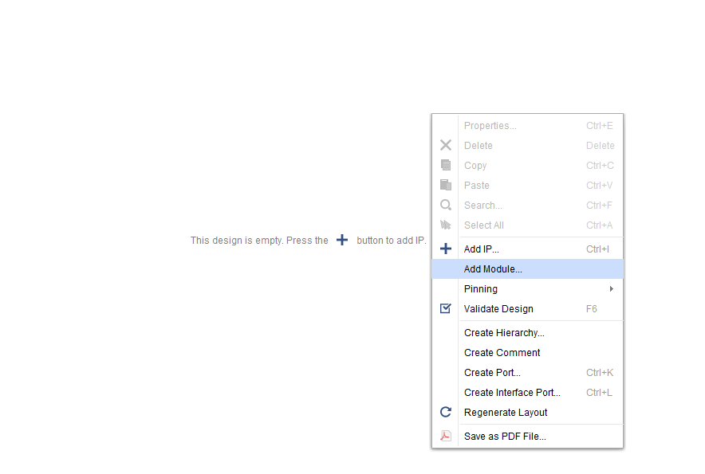
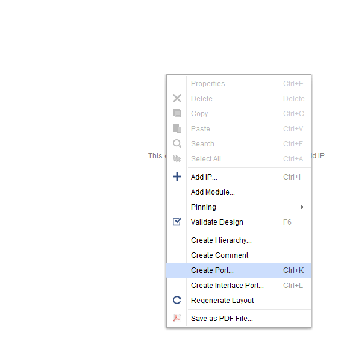
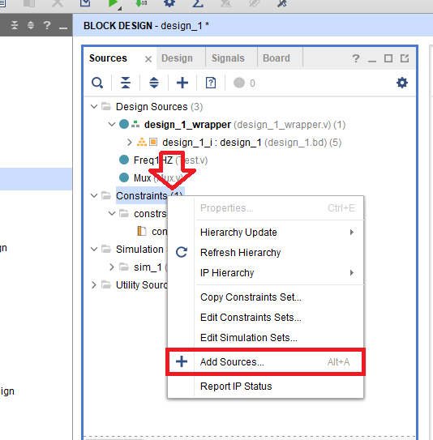
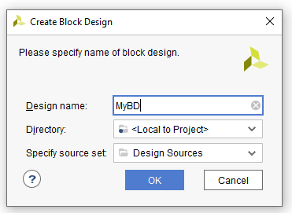
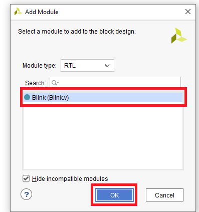
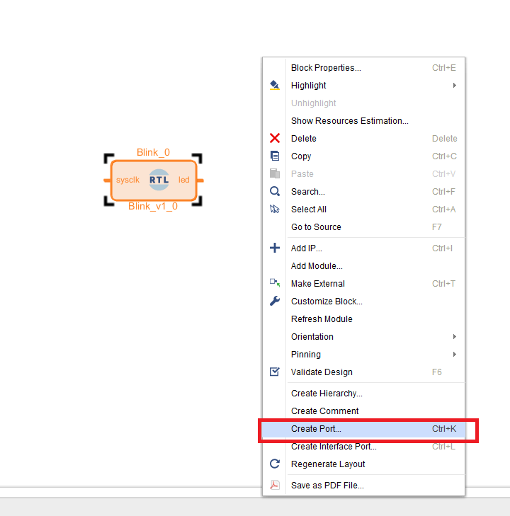
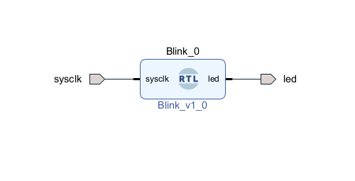

# Day 000: Environment Setup

Welcome to the RTLwith100Project tutorial series! This tutorial will guide you through setting up the development environment for the project. By the end of this day, you will have all the necessary tools installed and ready to begin.

## Prerequisites

Before getting started, make sure you have the following prerequisites:

- Vivado - any version but recommended version 2023.1
- FPGA dev board - this dev board is needed to run and test codes on the actual hardware

## Installation

Follow these steps to set up your environment:


1. **Vivado Installation**: Download and install Vivado, which is a popular FPGA development tool. You can download Vivado from the official Xilinx website at [link](https://www.xilinx.com/support/download.html). It is recommended to use version 2023.1, but any version should work.

2. **FPGA Dev Board Setup**: Connect your FPGA development board to your computer. Ensure that the necessary drivers are installed, if required, for your specific board. Refer to the board's documentation or the manufacturer's website for detailed instructions.

3. **Clone or Download the Repository**: Clone or download the RTLwith100Project repository from GitHub to your local machine. You can use the following command to clone the repository using Git:

   ```bash
   git clone https://github.com/AfshinKI/RTLwith100Projects.git

## Workflow Explanation

In our tutorials, we will follow a block diagram workflow, where the block diagram design will be the top file and every RTL design will be implemented into the diagram as an IP (as shown below).


**Advantages of the Block Diagram Method:**

The block diagram approach offers several advantages:

1. **Modularity**: The block diagram approach allows for a modular design structure, where individual RTL designs can be implemented as IP blocks and easily interconnected in the block diagram. This modularity enhances reusability and simplifies design management.

2. **Hierarchical Design**: The block diagram provides a hierarchical representation of the system or module, allowing for a clear understanding of the design's structure and organization. This hierarchical approach simplifies the management and maintenance of complex designs, as it enables the designer to focus on individual IP blocks and their interactions within the overall system.

3. **Visual Representation**: The block diagram offers a visual representation of the design, making it more intuitive and easier to comprehend. It allows designers to quickly grasp the overall system architecture and analyze the interconnections between different IP blocks. This visual representation aids in the debugging, verification, and overall understanding of the design.

Here's an overview of the workflow:
1. **Create Source Files**

   In this step, we will begin by creating RTL (Register Transfer Level) source files for your designs. These source files contain the hardware description using a hardware description language (HDL) such as VHDL or Verilog. For this tutorial series, we will mainly use Verilog.

   To create a Vivado project and set up the environment for RTL design, follow these steps:

   - Launch Vivado on your computer.
   - Click on "Create Project" in the Vivado welcome page.
   - Specify the project name, location, and select a project directory.
   - Choose the project type and target language. For RTL design, select "RTL Project" and "Verilog" as the target language.
   - Select the appropriate FPGA device for your project.
   - Click "Finish" to create the project.

   Once the project is created, you can add source files to it:

   - Right-click on the project in the Sources pane and select "Add Sources."
   - Choose the type of source file you want to add. There are three types: "Add or create design sources" for RTL source files, "Add or create simulation sources" for testbench files, and "Add or create constraints" for constraint files.
   - Select "Add Files" to add existing source files or "Create File" to create new source files within Vivado.


   After adding the Verilog source file(s), you can begin writing your hardware description code using Verilog syntax (or any other language you are most confortable with).

   It is important to note that this tutorial series focuses on RTL design using Verilog, but you can also use VHDL if you prefer. The concepts and principles covered in the tutorials apply to both languages, with the main difference being the syntax.

2. **Create Block Diagram and Add Source Files as IP**

   In this step, we will create a block diagram in Vivado and add the RTL source files as IP (Intellectual Property) blocks into the block diagram.

   To create a block diagram and add source files as IP, follow these steps:

   - In the Flow Navigator pane, click on "Create Block Diagram" under "IP Integrator."
   - Name the block diagram file and click "OK" to create it.
   - In the Diagram view, you will see the block diagram canvas.
   - To add an IP block, right-click on the canvas and select "Add Module."
   - In the Add Module dialog, search for the source file(s) you want to add as IP blocks. Select the desired source file(s) and click "OK" to add them as IP blocks in the block diagram.
   - Connect the IP blocks together in the block diagram to represent the desired interconnections and hierarchy of your design.

   

   By adding the source files as IP blocks in the block diagram using the "Add Module" option, you can import your own RTL modules into the design.

3. **Define Ports**

   In this step, we will define the input and output ports for your block diagram design. Ports serve as the interface to the external world, allowing communication between the FPGA and other components.

   To define ports in the block diagram, you have two options:

   a. **Make a Port External**:
      - Select the IP block in the block diagram canvas.
      - In the Properties pane, navigate to the "Ports and Interfaces" section.
      - Right-click on the desired port and select "Make External."
      - This will make the selected port an external port, enabling it to connect with other components outside the block diagram.

   b. **Add a Port from the Canvas**:
      - Right-click on the canvas in the block diagram.
      - Select "Add Port" from the context menu.
      - Specify the port name, direction (input or output), and data type.
      - This will add a new port directly on the canvas, which you can connect to the desired IP blocks.



   By defining ports for your block diagram design, you establish the communication interface that connects the internal logic of your design with the external world.

4. **Add Constraint File**

   In this step, we will add a constraint file to specify the pin assignments and other constraints for your design. Constraints ensure proper connectivity and communication with external components.

   To add a constraint file, follow these steps:

   - Right-click on the project in the Sources pane and select "Add Sources."
   - Choose "Add or create constraints" and click "Next."
   - Select "Add Files" and browse for the constraint file you want to add.
   - Click "Finish" to add the constraint file to your project.



   **Example: Defining a Clock Constraint**

Here is an example of a code block:


set_property -dict { PACKAGE_PIN K17   IOSTANDARD LVCMOS33 } [get_ports { sysclk }]; #IO_L12P_T1_MRCC_35 Sch=sysclk
create_clock -add -name sys_clk_pin -period 8.00 -waveform {0 4} [get_ports { sysclk }];

## Workflow Example: Creating a Simple LED Blink Project

In this example, we will demonstrate the step-by-step workflow for creating a Simple LED Blink project using the block diagram method.

1. **Create Source File**

   - Create a new Verilog source file called `Blink.v` in your Vivado project.
     

   - Write the hardware description code for the LED Blink functionality in the `Blink.v` file. For example, you can define an input `sysclk` and an output `led` using a counter with a 24-bit length. Assign bit 24 of the counter directly to the `led` output port. Here's an example code:

     ```verilog
     module Blink(
         input sysclk,
         output reg led
     );
         reg [24:0] counter;

         always @(posedge sysclk) begin
             counter <= counter + 1;
             led <= counter[24];
         end
     endmodule
     ```

     In this code, we define a 24-bit counter `counter` and increment it on every positive edge of the `sysclk` input. Bit 24 of the counter is directly assigned to the `led` output. This creates a blinking effect on the LED based on the frequency of the `sysclk` input.

2. **Create Block Diagram and Add Source File**

   - Create a block diagram in Vivado by navigating to "IP Integrator" and selecting "Create Block Diagram".
     

   - Name the block diagram file and click "OK" to create it.

   - Right-click on the block diagram canvas and select "Add Module" to add the `Blink.v` source file as an IP block in the block diagram.
     

   - This will open the "Add Module" dialog box. Browse for the `Blink.v` file and select it.
     

   - Click "OK" to add the `Blink.v` file as an IP block in the block diagram.

   - Now, you will see the `Blink` IP block added to the block diagram canvas.

   - Next, we need to create ports for the `Blink` IP block to interface with other components.

   - Now, you can wire up the ports of the `Blink` IP block to other components in the block diagram.

   - To create connections, click on the "+" button on the desired port and drag the connection line to the desired destination port.
     

   - This will add a port to the `Blink` IP block. Enter "sysclk" as the port name, select the appropriate direction and data type, and click "OK". Alternatively you can add ports by right clicking on the port and selecting "Make External" 

   - Repeat this process to create connections for all the necessary ports as shown below.
    

   - Ensure that you have properly connected the `sysclk` input of the `Blink` IP block to the clock source in the block diagram.

   - With this, you have successfully added the `Blink.v` source file as an IP block in the block diagram and created the necessary connections.

3. **Add Constraint File**

   - Right-click on the project in the Sources pane and select "Add Sources".

   - Choose "Add or create constraints" and click "Next".

   - Select "Add Files" and browse for the constraint file you want to add.

   - Click "Finish" to add the constraint file to your project.

   - Open the constraint file and add the following code to it:

     ```tcl
     # Constraint for sysclk
     set_property -dict { PACKAGE_PIN K17   IOSTANDARD LVCMOS33 } [get_ports { sysclk }]; #IO_L12P_T1_MRCC_35 Sch=sysclk
     create_clock -add -name sys_clk_pin -period 8.00 -waveform {0 4} [get_ports { sysclk }];

     # Constraint for led
     set_property -dict { PACKAGE_PIN M14   IOSTANDARD LVCMOS33 } [get_ports { led }]; #IO_L23P_T3_35 Sch=led[0]
     ```

   - Customize the constraint code according to your specific board and pin assignments. The above code is an example for the ZYBO Z7-10 development board. If you are using a different board, you will need to adjust the `PACKAGE_PIN` values based on the pin mapping of your board.

   - Save the constraint file.

   With this, you have successfully created the constraint file and added the necessary code to it. The constraints will ensure proper pin assignments and I/O standards for the `sysclk` and `led` ports on your board.

   **Note**: If you are using a different development board, refer to the board's documentation or datasheet to determine the correct pin assignments and I/O standards for your specific board.

4. **Simulate the Design**

   - Before generating the bitstream, it's a good practice to simulate the design to verify its functionality.

   - To simulate the design, we need to create a testbench and define the test scenario.

   - Create a new Verilog file for the testbench. You can name it `Blink_tb.v` or any suitable name.

   - In the testbench file, instantiate the `Blink` module and define the necessary input and output signals.

   - To feed a 125MHz clock to the `sysclk` input, create a clock signal in the testbench code. For example:

     ```verilog
     reg clk;
     always #4 clk = ~clk; // 125MHz clock with 8ns period
     ```

   - Connect the clock signal to the `sysclk` input of the `Blink` module.

   - Define any additional signals needed for testing, such as signals to monitor the behavior of the `led` output.

   - Write test scenarios to drive the inputs and check the outputs. For example:

     ```verilog
     initial begin
       #10; // Wait for some time

       // Drive inputs
       // ...

       // Check outputs
       // ...

       $finish; // End simulation
     end
     ```

   - Once you have written the testbench code, save the file.

   - In Vivado, go to the "Flow Navigator" pane and click on "Simulation" under "IP Integrator".

   - Vivado Simulator will open.

   - In the Vivado Simulator, click on "Add Sources" to add the `Blink.v` source file and the `Blink_tb.v` testbench file.

   - Click on "Run Simulation" to start the simulation.

   - Vivado Simulator will execute the testbench code and display the waveform of the signals.

   - Verify that the `led` output behaves as expected based on the test scenarios.

   - Make any necessary modifications to the design or testbench code if issues are found during simulation.

   - Once the simulation is successful and the design behaves as desired, you can proceed to generate the bitstream.


5. **Generate Bitstream**

   - Once you have completed the previous steps and verified that your design is error-free, you can proceed to generate the bitstream.

   - In Vivado, navigate to the "Flow Navigator" pane on the left side.

   - Click on "Generate Bitstream" under "Program and Debug".

   - Vivado will start the synthesis, implementation, and bitstream generation process.

   - Wait for the process to complete. This may take some time depending on the complexity of your design.

   - Once the bitstream generation is successful, you will see a green checkmark indicating completion.

   - Now, you can proceed to program your FPGA dev board with the generated bitstream.

   **Note**: Before programming the FPGA, ensure that your dev board is properly connected to your computer and the necessary drivers are installed.

6. **Program FPGA Dev Board**

   - Connect your FPGA dev board to your computer if it is not already connected.

   - In Vivado, navigate to the "Flow Navigator" pane.

   - Click on "Open Hardware Manager" under "Program and Debug".

   - Vivado Hardware Manager will open.

   - Click on "Open Target" and select your FPGA dev board from the list of available devices.

   - Once your dev board is recognized, click on "Program Device" to program the FPGA with the generated bitstream.

   - Vivado will start programming the FPGA. Wait for the process to complete.

   - After programming is successful, you should see the LEDs on your dev board blinking according to the design implemented.

   Congratulations! You have successfully generated the bitstream and programmed your FPGA dev board with the LED Blink design.


