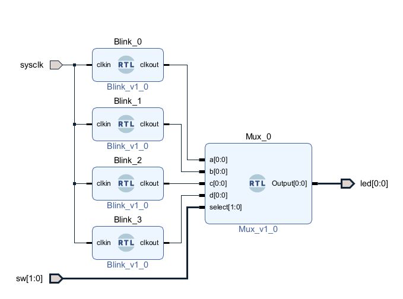
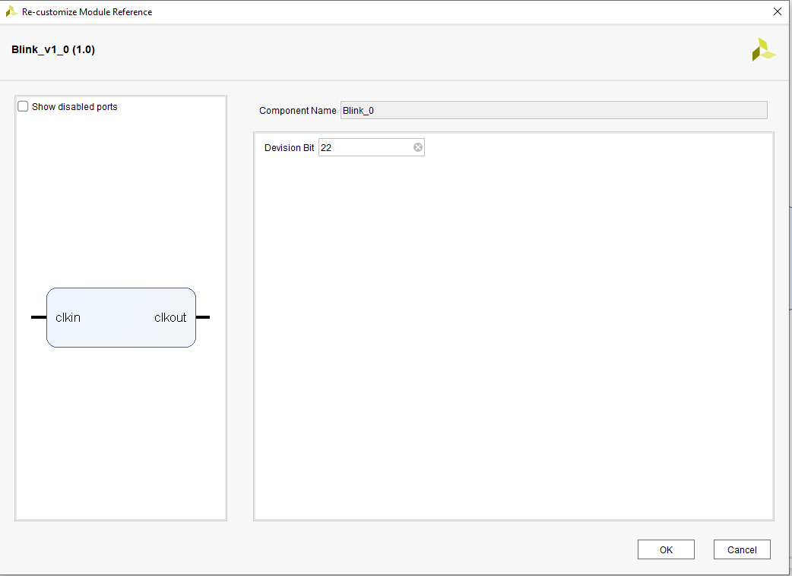
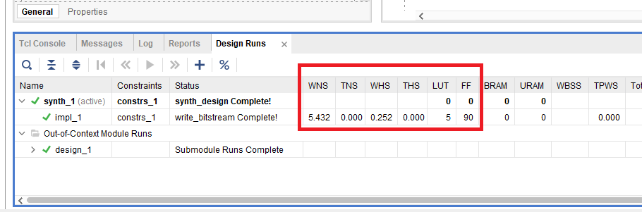
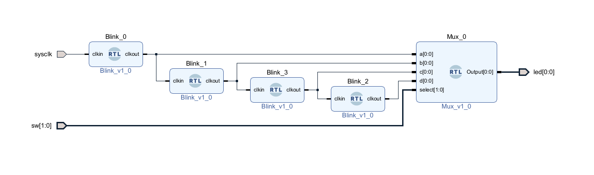
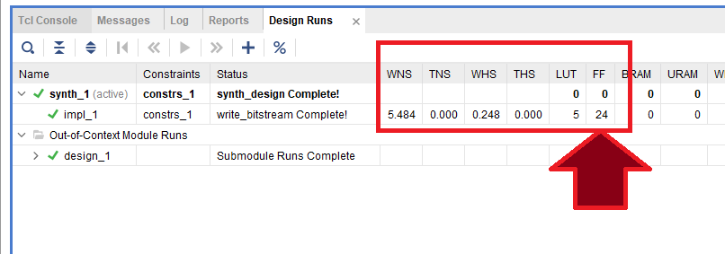
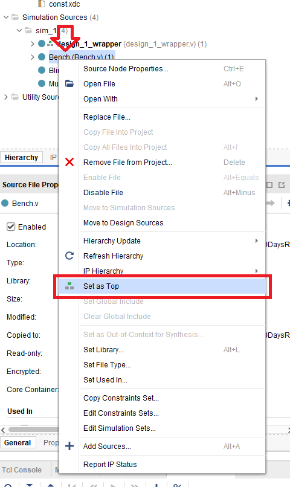
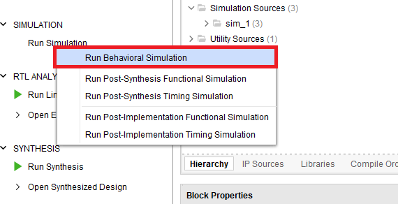

# Day 001: MUX and Resource Optimization

## Problem Statement

The problem is to create a program that utilizes two switches to control the blinking speed of an LED. The switches will have four possible states, where the "00" state will provide the fastest blink, and each subsequent state will divide the frequency by two.

## Solution Overview

To solve this problem, we will use the "Blink with Parameter" design and implement a Multiplexer (MUX) in RTL. We will then connect these components together in the block diagram to achieve the desired functionality.

> Note: This solution is not the only approach to solve the problem. We have chosen this solution specifically to explore the implementation using a block diagram.

## Project Structure

The project is organized as follows:

- `Blink_with_Parameter.v`: RTL source file containing the "Blink with Parameter" design. This design allows for variable blink speed based on a parameter input.

- `MUX.v`: RTL source file containing the implementation of the Multiplexer (MUX) module. The MUX selects the appropriate blink speed based on the state of the switches.

- `constraints.xdc`: Constraint file specifying the pin assignments and other constraints for the design.

- `Bench.v`: Bench top containing simulation parameters for testing the design.

## Getting Started

To get started with the project, follow these steps:

1. Download or clone the repository to your local machine.

2. Open Vivado and create a new project.

3. Add the necessary source files (`Blink_with_Parameter.v` and `MUX.v`) to the project.

4. Create a block diagram file (`design_1.bd`) and add the "Blink with Parameter" and MUX modules as IP blocks.

5. Make the required connections in the block diagram to integrate the modules.

6. Generate the bitstream for the design.

7. Download the bitstream to your FPGA board and test the functionality.

For detailed instructions and code examples, please refer to the project files and the provided tutorials.

## Design Analysis

One way we can connect the blocks to create four different blinking speeds is as follows:

In this design, double click on the Blink IP and set the fastest blink to 22 or higher (higher the value, slower the speed) as shown below:

Based on the problem requirements, the blink speed of the LED will double as the switch states go higher. Therefore, we need to set the second blink parameter to 23, the third one to 24, and the final block to 25. After generating the bitstream, we can see the resource usage as below:

To optimize resource usage, we can daisy-chain the blocks by using the output of the first block to drive the second stage. In this case, we only need one bit register in the design, and we can set the parameter to 1. By doing this, the new code will generate the same results but using almost 75% fewer flip flops.

Here is the resource usage for the optimized design:

## Simulation

To verify the functionality of the design before programming the FPGA board, a simulation environment is provided. The simulation files need to be located in the simulation folder. You can simulate the design using Vivado Simulator or any other supported simulator.

---

Feel free to explore the project and experiment with different configurations. Happy coding!
